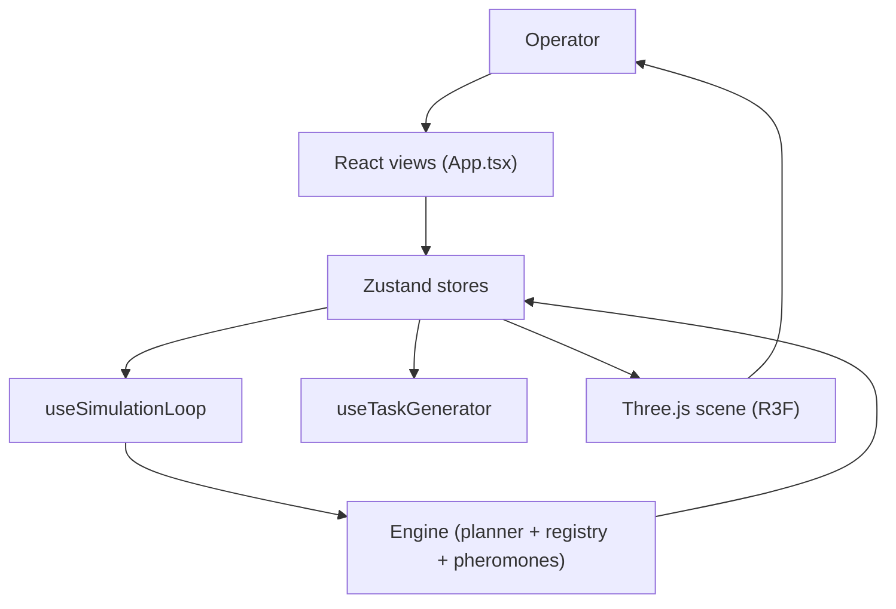

FleetForge is a single-page React application with no backend, no database, and no API server. Everything, from rendering to simulation to route coordination, runs inside the browser tab. The system is organized into five layers that keep the UI, state, simulation logic, and 3D scene cleanly separated.

## Five layers

| Layer | Modules | Responsibility |
| --- | --- | --- |
| VIEW | `App.tsx`, `AppShell`, page components | Render the seven views and handle operator input |
| STATE | `useFleetStore`, `useThemeStore` | Hold all UI-visible simulation and theme state |
| SIMULATION | `useSimulationLoop`, `useTaskGenerator` | Drive the coordinator, motion, and task production |
| ENGINE | `waypointGraph`, `routePlanner`, `routeRegistry`, `pheromoneMap` | Plan routes, reserve waypoints, and manage congestion |
| SCENE | `WarehouseScene`, `AMRs`, `WarehouseFloor` | Render the 3D digital twin with React Three Fiber |

The engine layer contains zero React imports. It is plain TypeScript that operates on data, which keeps it testable and lets components such as the sidebar poll it directly for live coordinator counters.

## Data flow

`useFleetStore` is the single source of truth. React components subscribe to it with selectors. The simulation loop reads robot state, builds a `PlannerContext`, runs A\* planning, acquires waypoint locks, and writes updates back to the store. The 3D scene reads positions and renders them but never writes back.

## Strict single-writer rule

During normal execution, the simulation loop is the only writer to robot state. Components dispatch explicit actions for operator commands such as `selectRobot`, `setRunning`, `toggleEmergencyStop`, and `setSpeed`. The R3F scene only reads. This rule prevents race conditions and makes the data flow predictable.

| Writer | What it writes |
| --- | --- |
| `useSimulationLoop` | `robots[].position`, `speed`, `battery`, `status`, `targetPosition`, and `events[]` |
| `useTaskGenerator` | `tasks[]` |
| Operator UI | `selectedRobotId`, `isRunning`, `isEmergencyStopped`, `simulationSpeed`, and per-robot patches |
| `resetSimulation` | Restores initial fleet, tasks, and obstacles; clears events and engine state |

## Cadence

| Process | Rate | Owner | Work |
| --- | --- | --- | --- |
| Coordinator tick | 5 Hz (`COORD_TICK_MS = 200`) | `runCoordinator` | Pick destination, plan route, publish and lock, handle WAIT and arrival timeouts |
| Motion tick | ~30 Hz (rAF frame gate) | `applyMotion` | Accelerate, decelerate, integrate position, drain battery, detect arrival |
| Pheromone decay | 5 Hz (called inside coordinator tick) | `pheromoneMap.decay` | Evaporate trails at 8% per second |
| Task generation | Every 10–30 s | `useTaskGenerator` | Create a task if active tasks are fewer than 20 |
| Registry sweep | Per coordinator tick | `routeRegistry.tick` | Expire stale locks and publications |

These rates are fixed constants in the source. The coordinator tick runs every 200 ms, the motion tick is gated by a 33 ms threshold inside `requestAnimationFrame`, and the task generator uses a randomized interval between 10 and 30 seconds.
