FleetForge drives each AMR through a pair of closely related state models. The public `RobotStatus` enum is what the dashboard displays in badges and telemetry panels. The internal `RobotPhase` type is what `useSimulationLoop` uses to decide when to plan, move, wait, or charge. This page maps both models, shows how they connect, and lists every timing constant that controls the loop.

## RobotStatus (UI)

`RobotStatus` lives in `src/types/fleet.ts` and is the only status shape that components render. The semantic tone for each value comes from `src/components/common/status.ts` via `toneOfStatus`.

| Value | Meaning | Tone |
| --- | --- | --- |
| `IDLE` | Robot has no active mission and is available for assignment. | `idle` (slate) |
| `MOVING_TO_PICKUP` | En route to a rack waypoint to collect a payload. | `ok` (green) |
| `ALIGNING` | Positioning precisely at the pickup waypoint. | `info` (blue) |
| `PICKING_UP` | Actuator cycle in progress; payload is being secured. | `info` (blue) |
| `CARRYING` | Transporting a secured payload toward a drop zone. | `ok` (green) |
| `DROPPING` | Releasing the payload at the destination. | `info` (blue) |
| `GOING_TO_CHARGE` | Low battery triggered a route to the nearest charging pad. | `charge` (cyan) |
| `OBSTACLE_DETECTED` | Static or dynamic obstacle is blocking the current path. | `danger` (red) |
| `WAITING` | Route is blocked by another robot; yielding until the path clears. | `warn` (amber) |

Components such as `StatusBadge` and `TelemetryInspector` read `toneOfStatus(status)` to pick the correct dot colour, background, and text class. The tone map is the single source of truth for colour, so no component re-declares its own palette.

## RobotPhase (internal)

`RobotPhase` is defined inside `src/hooks/useSimulationLoop.ts` and is never exported to the UI layer. It tracks the exact sub-state the coordinator needs to run the 5 Hz decision loop and the ~30 Hz motion loop.

| Field | Type | Purpose |
| --- | --- | --- |
| `phase` | `'IDLE' \| 'MOVING' \| 'WAITING' \| 'ALIGNING' \| 'PICKING_UP' \| 'DROPPING' \| 'CHARGING' \| 'OBSTACLE'` | Current internal phase. |
| `phaseStartedAt` | `number` | Timestamp (ms) when the robot entered this phase. Used for timeouts. |
| `currentWaypointId` | `string \| null` | Waypoint the robot currently occupies. |
| `nextWaypointId` | `string \| null` | Waypoint the robot is travelling toward. Null when waiting or arrived. |
| `path` | `string[] \| null` | Full planned waypoint sequence from current position to destination. |
| `destinationId` | `string \| null` | Final waypoint the current plan targets. |
| `waitingSince` | `number` | Timestamp when the robot entered `WAITING`; used for the 6 s hard timeout. |
| `lastPlanAt` | `number` | Timestamp of the most recent successful `planAndReserve` call. Guards replan cooldown. |
| `reachedTarget` | `boolean` | Set by `applyMotion` when the robot is within `ARRIVAL_TOL` of `nextWaypointId`. |

The coordinator reads `phase` to decide which branch to execute each tick. The motion loop only advances position when `phase === 'MOVING'` and `reachedTarget === false`.

## Transition diagram

The diagram below shows the full lifecycle from idle through pickup, carry, drop, and back to idle, plus the branches for blocking, charging, and obstacle recovery.

```mermaid
stateDiagram-v2
    [*] --> IDLE
    IDLE --> MOVING : task assigned / destination picked
    MOVING --> ALIGNING : arrived at pickup waypoint
    ALIGNING --> PICKING_UP : 500 ms elapsed
    PICKING_UP --> MOVING : payload secured; new drop route planned
    MOVING --> DROPPING : arrived at drop waypoint
    DROPPING --> IDLE : 800 ms elapsed; payload released

    MOVING --> WAITING : next waypoint blocked
    WAITING --> MOVING : lock granted or replan succeeds
    WAITING --> IDLE : WAIT_TIMEOUT_MS exceeded (6 s)

    IDLE --> MOVING : battery < 25 %; charger chosen
    MOVING --> CHARGING : arrived at charging pad
    CHARGING --> IDLE : battery >= 90 %

    MOVING --> OBSTACLE : obstacle detected
    OBSTACLE --> MOVING : 2000 ms elapsed
```

Key transition rules:

- `IDLE → MOVING` only happens when `nowMs - lastPlanAt >= REPLAN_COOLDOWN_MS`.
- `MOVING → WAITING` happens when `lockWaypoint(next)` fails during `advanceAlongPath`.
- `WAITING → IDLE` is the hard timeout after `WAIT_TIMEOUT_MS`; the robot releases its current lock, clears its path, and starts over.
- `CHARGING → IDLE` releases the charging pad lock and sets `destination: 'IDLE'`.

## Timing constants

All constants are defined in `src/hooks/useSimulationLoop.ts` unless noted otherwise.

| Constant | Value | Purpose |
| --- | --- | --- |
| `COORD_TICK_MS` | `200` | Coordinator decision loop runs at 5 Hz. |
| `WAIT_TIMEOUT_MS` | `6000` | Maximum time a robot may wait before forcing a full replan. |
| `REPLAN_COOLDOWN_MS` | `1500` | Minimum time between successive planning attempts from `IDLE`. |
| `MAX_SPEED` | `0.9` | Top linear speed in metres per second. |
| `ACCEL` | `0.4` | Acceleration in metres per second squared. |
| `DECEL` | `0.8` | Deceleration in metres per second squared. |
| `ARRIVAL_TOL` | `0.1` | Distance threshold in metres; below this the robot snaps to the waypoint. |

These values are deliberately conservative. `MAX_SPEED` was halved from an earlier `1.8` to give smoother visual motion, and `ACCEL`/`DECEL` were reduced from `1.2`/`1.5` for the same reason. If you want robots to move faster or stop harder, change these constants and reload the page. There is no runtime settings panel for kinematics.
